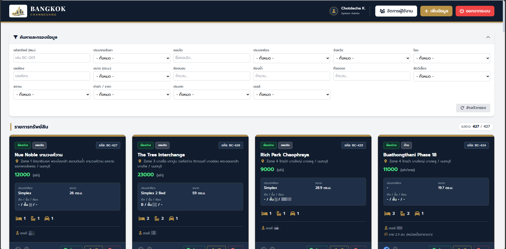
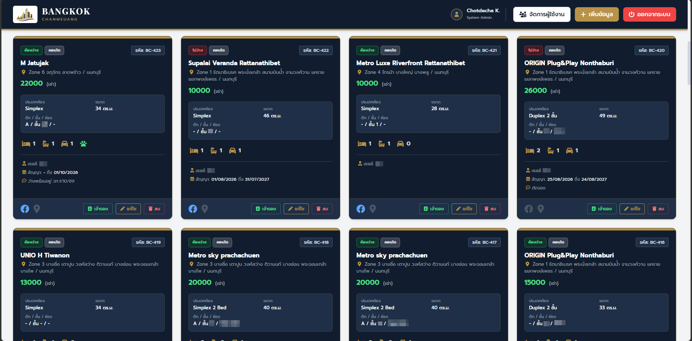
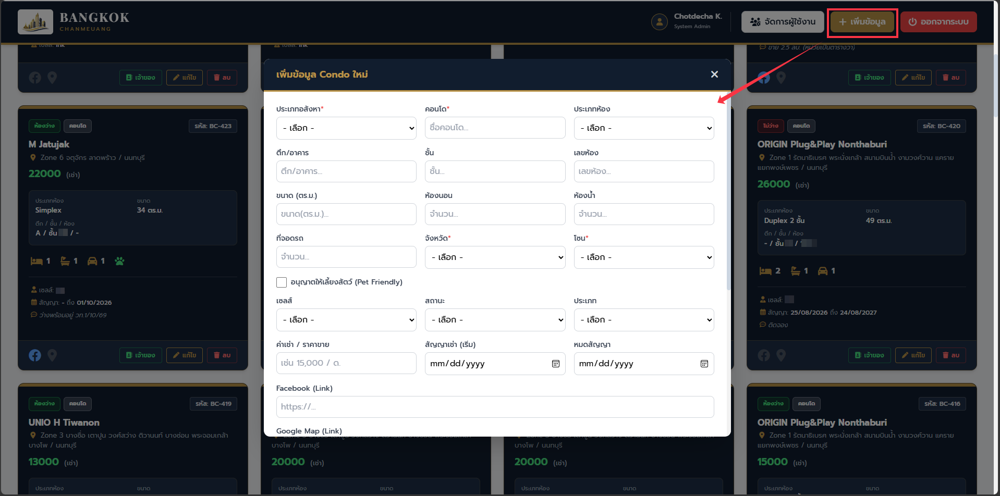
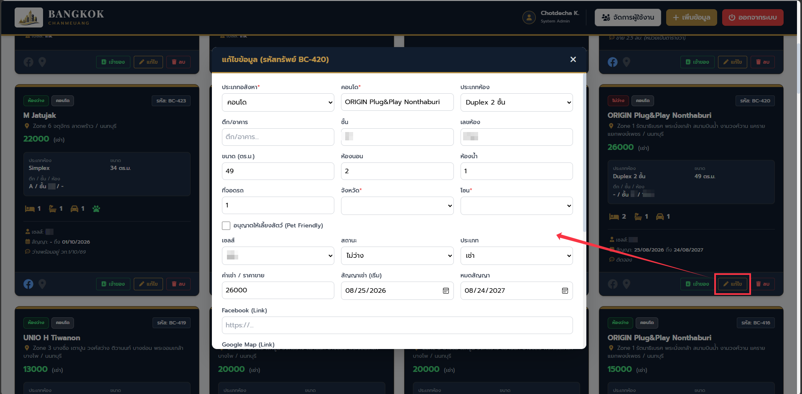
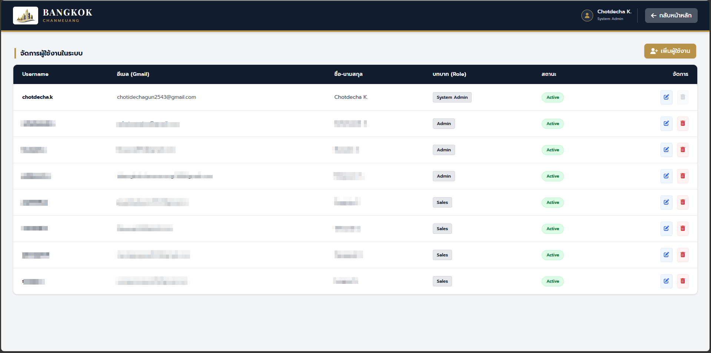

# Bangkok Chanmeuang - Real Estate Management System

A comprehensive, serverless web application designed to manage real estate and condominium listings. Built with Google Apps Script (backend API) and Google Sheets (database) to provide a cost-effective, maintainable, and fast solution for real estate agents.

## 🚀 Key Features

### 1. Secure Authentication & Role-Based Access Control (RBAC)
- **Login System:** Secure user authentication using SHA-256 password hashing.
- **Roles:** Access levels tailored for `System Admin`, `Admin`, `Sales`, and `User`.
- **Data Privacy:** Sensitive property owner information (Name, Phone, Line ID) is strictly restricted to Admins only.

### 2. Advanced Listing Management
- **Dynamic Dashboard:** A Single Page Application (SPA) feel, rendering hundreds of listings efficiently.
- **Multi-Criteria Filtering:** Filter properties instantly by Zone, Property Type, Price Range, Bedrooms, Parking, Pet-Friendly status, and Agent.
- **Client-Side Pagination:** Smooth navigation through large datasets without reloading the page.

### 3. Business Automation & Audit Logging
- **Lease Expiry Alerts:** An automated system that flags and alerts agents when a property's lease contract is expiring within the next 30 days.
- **Access Audit Trail:** An automated logging mechanism that records who viewed sensitive property owner data (capturing User, Property ID, Date, and Time).

## 🛠️ Technology Stack

- **Frontend:** HTML5, CSS3, Vanilla JavaScript (ES6+), Tailwind CSS
- **UI Components:** SweetAlert2 (for interactive pop-ups and notifications), FontAwesome
- **Backend (API):** Google Apps Script (REST-like endpoints)
- **Database:** Google Sheets API

## 🏗️ System Architecture

1. **Client Layer:** The user interacts with a responsive UI built with Tailwind CSS. Data fetching and filtering are handled asynchronously via JavaScript (`google.script.run`).
2. **Controller Layer:** `Code.js` and `User.js` act as the backend API, receiving requests, validating permissions, and applying business logic (e.g., password hashing).
3. **Data Layer:** Google Sheets acts as a serverless database, utilizing different sheets (`Condo Listing`, `User`, `Log`) to store records.

## 📸 Screenshots

- **Login Page**
  

- **Main Dashboard & Filter System**
  

- **Property Listings Overview**
  

- **Add Property Modal**
  

- **Edit Property Modal**
  

- **User Management Interface**
  

## ⚙️ Setup & Installation (Local Development)

Since this project utilizes Google Apps Script, it is deployed via the Google Cloud / Workspace ecosystem. 

1. Clone this repository to your local machine:
   ```bash
   git clone https://github.com/yourusername/bangkok-chanmeuang.git
   ```
2. Install `clasp` (Command Line Apps Script Projects) globally:
   ```bash
   npm install @google/clasp -g
   ```
3. Login to your Google account via clasp:
   ```bash
   clasp login
   ```
4. Push the code to your Google Apps Script project:
   ```bash
   clasp push
   ```
5. Deploy the script as a Web App from the Google Apps Script Editor to view it live.

---
**Developed by:** [Chotdecha Kongsawad](https://github.com/yourusername)
